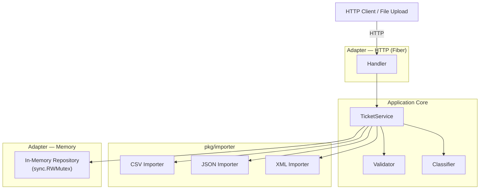

# 🏦 Homework 2: Intelligent Customer Support System

> **Student Name**: Roman Reznik
> **Date Submitted**: 10-05-2026
> **AI Tools Used**: [Claude Code, GitHub Copilot]

---
## 📋 Project Overview

A production-grade support ticket management system built in Go. Accepts tickets from multiple file formats, auto-classifies them by keyword analysis, and exposes a full REST API with Swagger documentation.

## Documentation

| Document | Audience | Content |
|----------|----------|---------|
| **README.md** *(this file)* | Developers | Overview, quick start, project structure |
| [docs/API_REFERENCE.md](docs/API_REFERENCE.md) | API consumers | Endpoints, schemas, error codes, cURL examples |
| [docs/ARCHITECTURE.md](docs/ARCHITECTURE.md) | Technical leads | Component design, data flow, design decisions |
| [docs/TESTING_GUIDE.md](docs/TESTING_GUIDE.md) | QA engineers | Test inventory, coverage, manual checklist, benchmarks |

---

## Features

- **Multi-format import** — bulk-load tickets from CSV, JSON, or XML in a single HTTP call
- **Auto-classification** — keyword-based engine assigns category and priority with a confidence score
- **Full CRUD API** — create, read, update, delete tickets; filter by status, category, priority, or customer
- **Hexagonal architecture** — domain, ports, adapters cleanly separated; swap storage or framework without touching business logic
- **Swagger UI** — interactive API docs served at `/swagger/`
- **Docker-ready** — multi-stage build produces a ~15 MB Alpine image; Compose runs the full stack in one command

---

## Architecture



Full component descriptions, sequence diagrams, and design decisions: [docs/ARCHITECTURE.md](docs/ARCHITECTURE.md)

---

## Project Structure

```
homework-2/
├── src/
│   ├── cmd/api/                   # Entry point — DI wiring, server setup
│   ├── internal/
│   │   ├── domain/                # Ticket entity, enums, typed errors
│   │   ├── ports/
│   │   │   ├── in/                # TicketService interface (use cases)
│   │   │   └── out/               # TicketRepository interface (storage)
│   │   ├── service/               # Validator, Classifier, TicketServiceImpl
│   │   └── adapters/
│   │       ├── in/http/           # Fiber HTTP handlers
│   │       └── out/memory/        # sync.RWMutex map repository
│   ├── pkg/
│   │   ├── importer/              # CSV / JSON / XML parsers
│   │   ├── errorhandler/          # Global Fiber error mapper
│   │   └── middleware/            # RequestID, logger
│   └── tests/                     # Black-box integration + performance tests
│       └── fixtures/              # Sample data for tests
├── docs/                          # Additional documentation
├── sample_data/                   # 50-row CSV, 20-record JSON, 30-record XML
├── Dockerfile
├── docker-compose.yml
└── README.md                      # This file
```

---

## Quick Start

### Docker (recommended — no Go required)

```bash
# Start API on :8080
docker compose up --build

# Start API + Swagger UI on :8080 and :8081
docker compose --profile docs up --build
```

### Local (requires Go 1.23+)

```bash
cd homework-2/src
go run ./cmd/api
```

The server starts on port `8080` by default. Set `PORT=<n>` to override.

---

## API Overview

| Method | Path | Description |
|--------|------|-------------|
| GET | `/health` | Health check |
| POST | `/tickets` | Create ticket |
| POST | `/tickets/import` | Bulk import CSV / JSON / XML |
| GET | `/tickets` | List with optional filters |
| GET | `/tickets/:id` | Get single ticket |
| PUT | `/tickets/:id` | Update ticket |
| DELETE | `/tickets/:id` | Delete ticket |
| POST | `/tickets/:id/auto-classify` | Run auto-classification |
| GET | `/swagger/*` | Interactive Swagger UI |

Full request/response schemas and cURL examples: [docs/API_REFERENCE.md](docs/API_REFERENCE.md)

---

## Running Tests

```bash
cd homework-2/src

go test ./...                     # All tests
go test ./tests/... -v            # Integration tests only

# Cross-package coverage
go test -coverpkg=./... -coverprofile=coverage.out ./...
go tool cover -func=coverage.out | grep total   # 89.1%
```

Full test inventory, coverage breakdown, benchmarks, and manual checklist: [docs/TESTING_GUIDE.md](docs/TESTING_GUIDE.md)

---

## Sample Data

Pre-generated fixtures in `sample_data/`:

| File | Records |
|------|---------|
| `sample_tickets.csv` | 50 |
| `sample_tickets.json` | 20 |
| `sample_tickets.xml` | 30 |
| `invalid_tickets.{csv,json,xml}` | 5 each |
