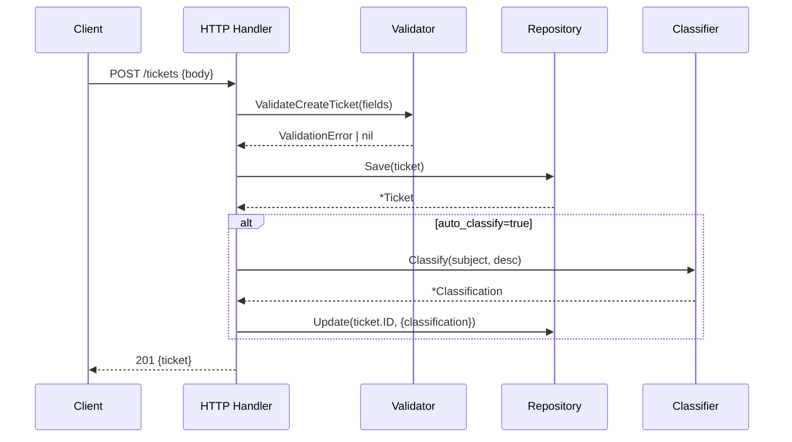
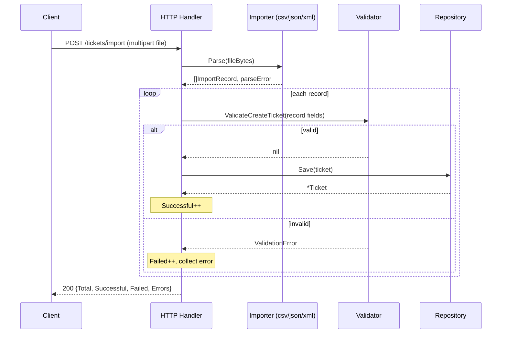
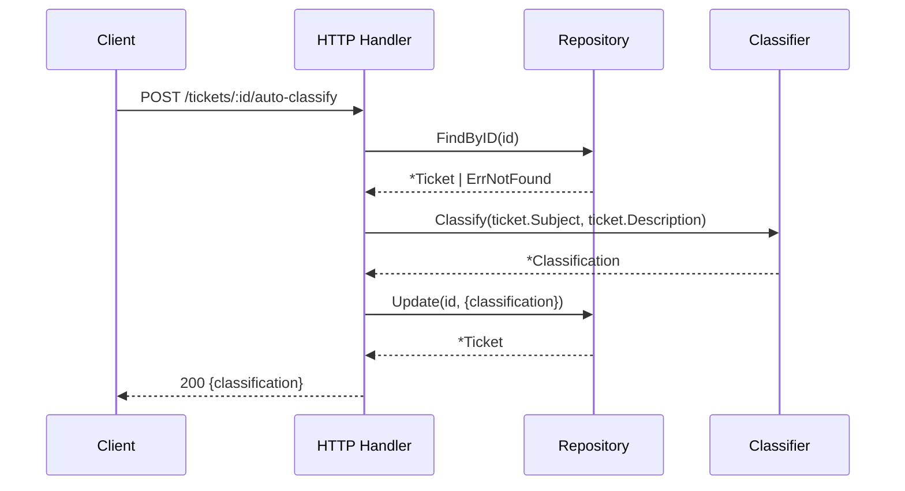

# Architecture

## Overview

The system is built on **hexagonal architecture** (ports & adapters), keeping the business domain free of any framework dependency. All external concerns — HTTP, storage, file parsing — are plugged in through well-defined interfaces.

```
┌─────────────────────────────────────────────────┐
│                  Domain Layer                   │
│  Ticket entity · enums · typed errors           │
│  (pure Go, zero external imports)               │
└────────────┬───────────────────────┬────────────┘
             │ PortIn                │ PortOut
             ▼                       ▼
┌────────────────────┐   ┌─────────────────────────┐
│  TicketService     │   │  TicketRepository        │
│  (interface)       │   │  (interface)             │
└────────────────────┘   └─────────────────────────┘
             ▲                       ▲
             │ implements            │ implements
┌────────────────────┐   ┌─────────────────────────┐
│  service/          │   │  adapters/out/memory/    │
│  TicketServiceImpl │   │  sync.RWMutex map        │
│  Validator         │   └─────────────────────────┘
│  Classifier        │
│  pkg/importer      │
└────────────────────┘
             ▲
             │ uses PortIn
┌────────────────────┐
│  adapters/in/http/ │
│  Fiber Handler     │
└────────────────────┘
             ▲
             │ HTTP
         Clients
```

---

## Component Descriptions

### Domain (`internal/domain/`)

The innermost layer. Contains:
- `Ticket` — central entity with all fields, including optional `Classification` and `Metadata`
- Enum types: `Category`, `Priority`, `Status`, `Source`, `DeviceType`
- `NewTicket()` constructor
- Typed errors: `ErrValidation`, `ErrNotFound`, `ErrInvalidInput`

No imports from outside the standard library. Can be compiled and tested in isolation.

### Ports (`internal/ports/`)

Thin interface layer that defines the contracts between layers.

**`ports/in/TicketService`** — inbound use-case contract:
```
Create · BulkImport · List · GetByID · Update · Delete · AutoClassify
```

**`ports/out/TicketRepository`** — outbound storage contract:
```
Save · FindByID · FindAll · Update · Delete
```

Changing the storage from in-memory to PostgreSQL requires only a new `out` adapter — zero changes to the domain or service.

### Application Service (`internal/service/`)

Contains all business logic. Three collaborating objects:

| Object | Responsibility |
|--------|---------------|
| `Validator` | Validates all input fields (email regex, length, enum membership) |
| `Classifier` | Keyword-based category and priority assignment with confidence score |
| `TicketServiceImpl` | Orchestrates repo, validator, classifier, and importers |

`BulkImport` dispatches to the correct `pkg/importer` based on the format string, validates each record via `Validator`, then saves successful ones via the repository. Failures are collected per-row and returned in `BulkImportResult`.

### Importers (`pkg/importer/`)

Three implementations of the `TicketImporter` interface:

| File | Format | Parser |
|------|--------|--------|
| `csv.go` | CSV | `encoding/csv` with header-to-field mapping |
| `json.go` | JSON | `encoding/json`, expects a top-level array |
| `xml.go` | XML | `encoding/xml`, `<tickets><ticket>…</ticket></tickets>` |

Each returns `([]ImportRecord, error)`. Parse-level errors (malformed file) surface as `error`; row-level errors (missing field) surface in `BulkImportResult.Errors`.

### HTTP Adapter (`internal/adapters/in/http/`)

Pure translation layer. Responsibilities:
- Parse and bind HTTP request body / query params
- Call the `TicketService` interface
- Write the JSON response with the correct status code
- Attach Swagger annotations

Contains no business logic. All validation lives in `Validator`; all routing lives in `server.go`.

### Memory Repository (`internal/adapters/out/memory/`)

Implements `TicketRepository` using a `map[uuid.UUID]*domain.Ticket` protected by `sync.RWMutex`.

`FindAll` applies `TicketFilter` in memory: iterates the map, skips non-matching tickets. Concurrent reads do not block each other; writes take an exclusive lock.

---

## Data Flow

### Create Ticket



### Bulk Import



### Auto-Classify



---

## Classifier Design

The classifier uses a keyword lookup table per category and per priority level. It produces a deterministic result with no external dependencies.

**Scoring:**

```
confidence = matched_keywords / len(category_keywords)    (capped at 1.0)
```

When multiple categories match, the one with the most keyword hits wins. Ties break alphabetically for determinism.

**Keyword tables:**

| Category | Keywords |
|----------|----------|
| `account_access` | login, password, 2fa, access, account, locked out, sign in |
| `technical_issue` | error, crash, bug, broken, not working, 500, exception, fail |
| `billing_question` | payment, invoice, refund, charge, billing, subscription, price |
| `feature_request` | feature, enhancement, suggestion, request, would like, add support |
| `bug_report` | reproduce, steps to, expected, actual, defect, regression |

| Priority | Keywords |
|----------|----------|
| `urgent` | can't access, critical, production down, security, outage, breach |
| `high` | important, blocking, asap, urgent, immediately |
| `low` | minor, cosmetic, nice to have, when possible |
| `medium` | *(default when no priority keyword matches)* |

---

## Design Decisions

### 1. In-memory storage over a database

**Rationale:** Keeps the project self-contained for a learning context. The `TicketRepository` interface abstracts storage entirely — swapping to PostgreSQL requires writing one new `adapters/out/postgres/` package.

**Trade-off:** Data is lost on restart. Not suitable for production as-is.

### 2. Keyword-based classification over ML

**Rationale:** Deterministic, zero-latency, no external service dependency, 100% testable offline.

**Trade-off:** Cannot handle synonyms or context. Confidence scores are approximate. A future ML/LLM classifier can plug in by implementing the same `Classifier` struct interface.

### 3. Partial success on bulk import

**Rationale:** Rejecting an entire 1,000-row file because row 47 has a bad email is poor UX. Callers can inspect per-row errors and re-submit only the failed rows.

**Trade-off:** Callers must check `BulkImportResult.Failed` to know if all records were accepted.

### 4. Global error handler

**Rationale:** All business errors bubble up as typed Go errors to Fiber's error handler, which maps them to HTTP status codes in one place. Handlers stay clean.

**Trade-off:** Requires discipline to never return raw `fiber.Error` from the service layer.

### 5. No mocks in tests

**Rationale:** All tests use real implementations wired via `newApp()`. This catches integration bugs that mocks hide, and eliminates the maintenance burden of mock objects.

**Trade-off:** Tests are slightly slower and cannot easily inject faults.

---

## Security Considerations

| Area | Current State | Hardening Path |
|------|--------------|----------------|
| Authentication | None | Add API key or JWT middleware in `server.go` |
| Input validation | Email regex, length bounds, enum whitelist | Add rate limiting, request-size limit |
| CORS | Default Fiber (none) | Add `github.com/gofiber/fiber/v2/middleware/cors` |
| Sensitive data | No PII logging | Redact email/name in structured logs |
| File upload | Size not limited | Add `fiber.Config{BodyLimit: 10*1024*1024}` |

---

## Performance Considerations

| Scenario | Current behaviour | Bottleneck |
|----------|------------------|------------|
| Single-ticket read | O(1) — direct map lookup | — |
| List with filter | O(n) — linear scan | Replace with indexed map per field at > ~100k tickets |
| Bulk import (50 rows) | ~0.1 ms/op | Parsing, not I/O |
| Auto-classify | ~1 µs/op | String comparison, O(keywords) |
| Concurrent writes | `sync.RWMutex` exclusive lock | Replace with `sync.Map` or shard at high concurrency |

Benchmark results from `go test ./tests/... -bench=. -benchmem`:

| Benchmark | ops/ns | allocs/op |
|-----------|--------|-----------|
| `BenchmarkPerf_ValidatorValid` | ~1 µs | low |
| `BenchmarkPerf_Classifier` | ~2 µs | low |
| `BenchmarkPerf_CSVImporter` | ~50 µs (50 rows) | moderate |
| `BenchmarkPerf_HTTPCreateTicket` | ~5 µs | moderate |
| `BenchmarkPerf_ConcurrentHTTPCreate` | ~4.5 µs/op | moderate |
