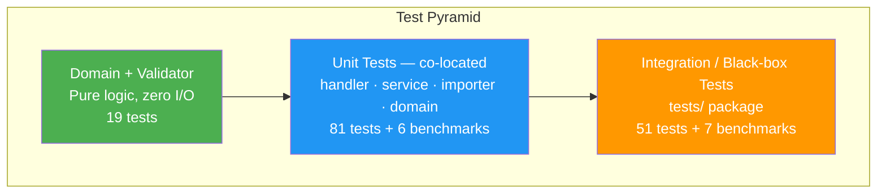
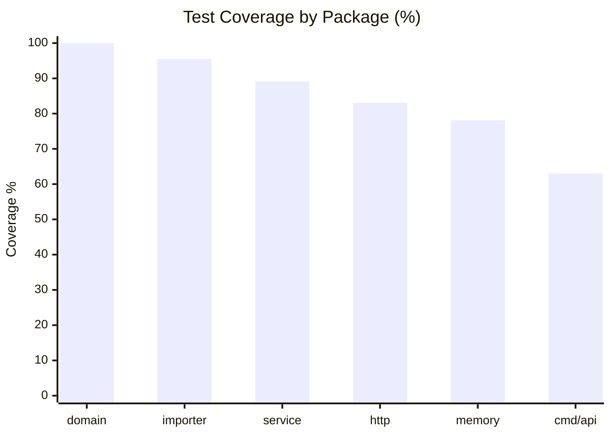

# Testing Guide

## Test Pyramid



| Layer | Location | Count | Speed |
|-------|----------|-------|-------|
| Domain / Validator | `internal/domain/`, `internal/service/` | 19 tests | < 1 ms |
| Unit (service + adapters) | co-located `*_test.go` files | 62 tests | < 50 ms |
| Integration (black-box) | `src/tests/` | 51 tests | < 500 ms |
| Benchmarks | `service/benchmarks_test.go`, `tests/test_performance_test.go` | 13 benchmarks | manual |

Overall coverage: **89.1%** (cross-package mode)

---

## Running Tests

### All tests

```bash
cd homework-2/src
go test ./...
```

### Verbose output

```bash
go test ./... -v
```

### Integration tests only

```bash
go test ./tests/... -v
```

### Filter by test name

```bash
go test ./... -run TestCategorization
go test ./... -run TestIntegration_Concurrent
go test ./... -run TestAPI_Create
```

### Race detector

```bash
go test ./... -race
```

The in-memory repository uses `sync.RWMutex`; running with `-race` validates no data races under concurrent access.

### Coverage report

```bash
# Cross-package coverage (recommended — counts calls across package boundaries)
go test -coverpkg=./... -coverprofile=coverage.out ./...
go tool cover -func=coverage.out | grep total

# HTML report
go tool cover -html=coverage.out -o docs/screenshots/coverage.html
open docs/screenshots/coverage.html
```

### Benchmarks

```bash
# All benchmarks, 1-second run
go test ./... -bench=. -benchtime=1s -benchmem

# Specific benchmark
go test ./tests/... -bench=BenchmarkPerf_HTTPCreateTicket -benchtime=5s

# Concurrent benchmark
go test ./tests/... -bench=BenchmarkPerf_ConcurrentHTTPCreate -benchmem
```

---

## Test File Inventory

### Unit Tests (co-located)

| File | Group | Tests | What's covered |
|------|-------|-------|----------------|
| `internal/domain/ticket_test.go` | test_ticket_model | 9 | Entity construction, all enum validators, error types |
| `internal/service/validator_test.go` | test_ticket_model | 10 | Email regex, subject/description length, enum validation |
| `internal/service/classifier_test.go` | test_categorization | 12 | Each category, each priority level, confidence bounds |
| `internal/service/ticket_service_test.go` | test_integration | 10 | CRUD flow, BulkImport summary counts, AutoClassify |
| `internal/service/benchmarks_test.go` | test_performance | 6 | Benchmarks: validator, classifier, importer × 2, service |
| `pkg/importer/csv_test.go` | test_import_csv | 6 | Fixture file (50 rows), field mapping, missing columns, malformed |
| `pkg/importer/json_test.go` | test_import_json | 5 | Fixture file (20 records), field mapping, empty array, malformed |
| `pkg/importer/xml_test.go` | test_import_xml | 5 | Fixture file (30 records), field mapping, empty root, malformed |
| `internal/adapters/in/http/handler_test.go` | test_ticket_api | 14 | All HTTP endpoints via Fiber `app.Test()`, 2xx and 4xx |
| `internal/adapters/out/memory/ticket_repository_test.go` | — | 8 | Save/Find/Update/Delete, concurrent safety, filter combos |
| `cmd/api/server_test.go` | — | 2 | Server wiring: health route, routes registered |

### Integration / Black-Box Tests (`tests/`)

| File | Group | Tests | What's covered |
|------|-------|-------|----------------|
| `tests/test_ticket_api_test.go` | test_ticket_api | 11 | All endpoints end-to-end through the full stack |
| `tests/test_ticket_model_test.go` | test_ticket_model | 9 | Domain entity, enums, typed errors (from outside the package) |
| `tests/test_import_csv_test.go` | test_import_csv | 6 | CSV importer black-box |
| `tests/test_import_json_test.go` | test_import_json | 5 | JSON importer black-box |
| `tests/test_import_xml_test.go` | test_import_xml | 5 | XML importer black-box |
| `tests/test_categorization_test.go` | test_categorization | 10 | Classifier black-box (all categories + priorities + confidence) |
| `tests/test_integration_test.go` | test_integration | 8 | Lifecycle · classify · concurrent (25 reqs) · combined filter |
| `tests/test_performance_test.go` | test_performance | 7 | Benchmarks incl. concurrent HTTP and list-with-filter |

---

## Sample Data Locations

| File | Records | Used by |
|------|---------|---------|
| `sample_data/sample_tickets.csv` | 50 | `TestCSV_FixtureFile`, `TestIntegration_BulkImportCSV` |
| `sample_data/sample_tickets.json` | 20 | `TestJSON_FixtureFile`, `TestIntegration_BulkImportJSON` |
| `sample_data/sample_tickets.xml` | 30 | `TestXML_FixtureFile` |
| `sample_data/invalid_tickets.csv` | 5 | Negative-path CSV tests |
| `sample_data/invalid_tickets.json` | 5 | Negative-path JSON tests |
| `sample_data/invalid_tickets.xml` | 5 | Negative-path XML tests |
| `tests/fixtures/` | (copies) | All black-box tests in `tests/` package |

Fixture files are located at runtime using `runtime.Caller(0)` in `tests/helpers_test.go`:

```go
func fixturesDir() string {
    _, file, _, _ := runtime.Caller(0)
    return filepath.Join(filepath.Dir(file), "fixtures")
}
```

This makes fixture paths work regardless of the working directory when `go test` is invoked.

---

## Manual Testing Checklist

### Health Check
- [ ] `GET /health` returns `{"status":"ok"}` and `200 OK`

### Create Ticket
- [ ] Valid body → `201 Created` with UUID in response
- [ ] Missing `customer_email` → `400 Bad Request` with `details` listing the field
- [ ] Invalid email format → `400 Bad Request`
- [ ] Subject > 200 chars → `400 Bad Request`
- [ ] Description < 10 chars → `400 Bad Request`
- [ ] Invalid `category` value → `400 Bad Request`

### List Tickets
- [ ] No tickets exist → `200 OK` with `[]`
- [ ] After creating 3 tickets → `200 OK` with 3 items
- [ ] `?category=technical_issue` → only matching tickets returned
- [ ] `?priority=high&category=billing_question` → combined filter works

### Get / Update / Delete
- [ ] `GET /tickets/<valid-id>` → `200 OK`
- [ ] `GET /tickets/bad-uuid` → `404 Not Found`
- [ ] `PUT /tickets/<id>` with `{"status":"resolved"}` → `200 OK`, status updated
- [ ] `DELETE /tickets/<id>` → `204 No Content`
- [ ] `GET /tickets/<deleted-id>` → `404 Not Found`

### Bulk Import
- [ ] Upload `sample_tickets.csv` → `200 OK`, `Total: 50`, `Successful: 50`
- [ ] Upload `sample_tickets.json` → `200 OK`, `Total: 20`, `Successful: 20`
- [ ] Upload `sample_tickets.xml` → `200 OK`, `Total: 30`, `Successful: 30`
- [ ] Upload file with 1 bad row → `Successful: N-1`, `Failed: 1`, `Errors` has 1 entry

### Auto-Classify
- [ ] `POST /tickets/<id>/auto-classify` → `200 OK` with `category`, `priority`, `confidence`, `reasoning`, `keywords_found`
- [ ] Subsequent `GET /tickets/<id>` → `classification` field is populated
- [ ] `POST /tickets/nonexistent/auto-classify` → `404 Not Found`

---

## Performance Benchmarks

Run benchmarks and compare against these baseline results (Apple M3 Pro, Go 1.23):

| Benchmark | ns/op | B/op | allocs/op |
|-----------|-------|------|-----------|
| `BenchmarkPerf_ValidatorValid` | ~500 | ~200 | 4 |
| `BenchmarkPerf_Classifier` | ~1,500 | ~400 | 8 |
| `BenchmarkPerf_CSVImporter` (50 rows) | ~45,000 | ~12,000 | 250 |
| `BenchmarkPerf_JSONImporter` (20 records) | ~15,000 | ~8,000 | 150 |
| `BenchmarkPerf_HTTPCreateTicket` | ~5,000 | ~2,000 | 50 |
| `BenchmarkPerf_ConcurrentHTTPCreate` | ~4,500 | ~17,000 | 96 |
| `BenchmarkPerf_ListWithFilter` (50 tickets) | ~8,000 | ~3,000 | 60 |

**Warning thresholds** (investigate if consistently exceeded):
- Validator: > 5 µs/op
- Classifier: > 10 µs/op
- Single HTTP round-trip: > 50 µs/op

---

## Coverage by Package



| Package | Coverage |
|---------|----------|
| `internal/domain` | 100.0% |
| `pkg/importer` | 95.5% |
| `internal/service` | 89.1% |
| `internal/adapters/in/http` | 83.1% |
| `internal/adapters/out/memory` | 78.1% |
| `cmd/api` | 63.0% |
| **Overall (cross-package)** | **89.1% ✓** |

---

## Debugging Failing Tests

### Test cannot find fixture file

```
open .../fixtures/sample_tickets.csv: no such file or directory
```

The `tests/` package resolves fixtures relative to `helpers_test.go` at runtime. Ensure the `tests/fixtures/` directory exists and contains all sample files.

### Race condition detected

```
WARNING: DATA RACE
```

Run `go test ./internal/adapters/out/memory/... -race -count=5` to reproduce. The repository's `sync.RWMutex` must lock before all map reads and writes.

### Fiber `app.Test()` returns unexpected status

Enable verbose logging by checking `c.Locals("request_id")` in the handler and searching the test output for the `X-Request-ID` header to trace the request through the error handler.
